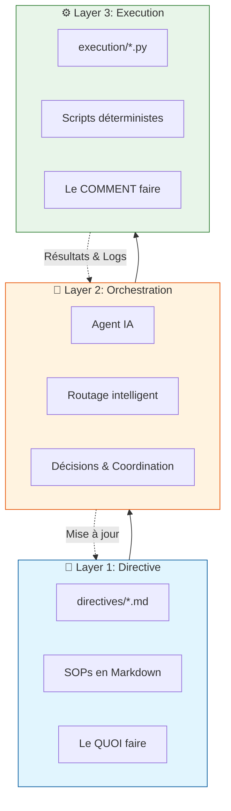
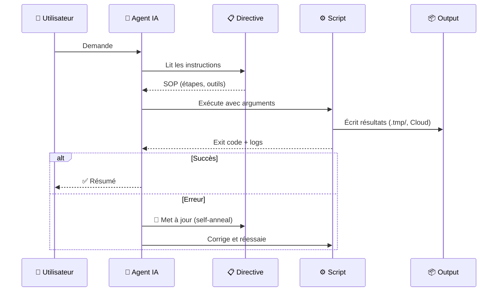

# Architecture 3-Layers

Cette architecture sépare les préoccupations pour maximiser la fiabilité des systèmes pilotés par IA.

## Vue d'ensemble



## Flux de données



## Rôle de chaque couche

| Layer | Responsabilité | Fichiers | Langage |
|-------|---------------|----------|---------|
| **Directive** | Définir les objectifs, inputs, outputs, edge cases | `directives/*.md` | Markdown |
| **Orchestration** | Lire les directives, décider, appeler les scripts | Agent IA (Claude, Gemini) | - |
| **Execution** | Effectuer le travail concret (APIs, calculs, I/O) | `execution/*.*` | Python, JS, Go, etc. |

## Pourquoi cette architecture ?

### Problème
Les LLMs sont **probabilistes** (90% de précision par étape). Sur 5 étapes :
```
0.90 × 0.90 × 0.90 × 0.90 × 0.90 = 59% de succès 😰
```

### Solution
Pousser la complexité vers le **code déterministe** :
- Scripts testables avec 100% de précision
- L'agent ne fait que le routage (décisions simples)
- Self-annealing : le système apprend de ses erreurs

## Bonnes pratiques

### Directives
- Écrire comme pour un employé mid-level
- Toujours référencer les scripts à utiliser
- Documenter les edge cases découverts

### Scripts
- Un script = une responsabilité
- Retourner des exit codes explicites
- Écrire les logs vers stderr, les données vers stdout/.tmp

### Self-Annealing
Quand une erreur survient :
1. Lire le message d'erreur
2. Corriger le script
3. Tester à nouveau
4. **Mettre à jour la directive** avec les learnings
